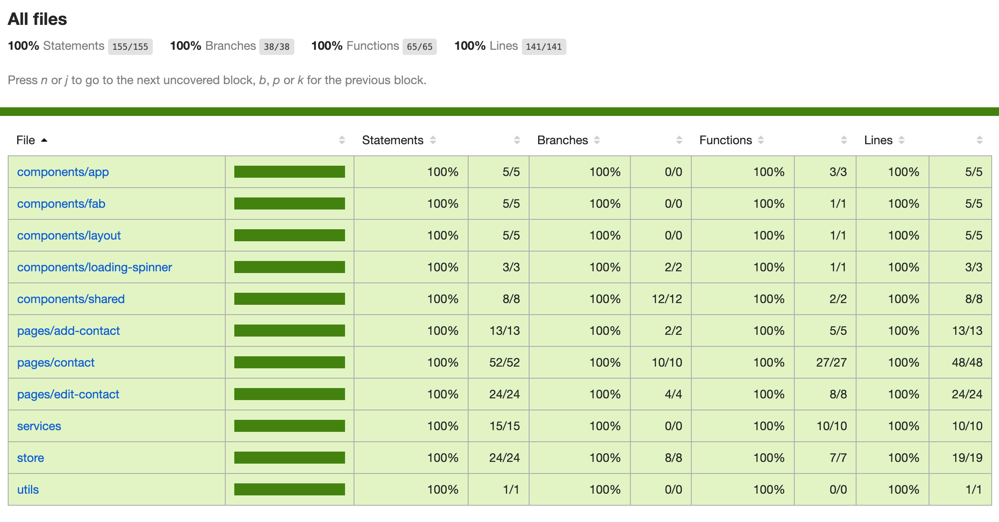

## Simple Contact App

**Live Demo 🔥**:

- https://loving-golick-8a1d7a.netlify.app/


### Pre Run

Before you run the project, you have to create the local env first by running this command (*assuming you already inside the project `root` directory*).

```shell
touch .env.development.local
```

That command will create `env` file for you. Open it and add

```shell
REACT_APP_SERVER_API=<your-server-api-host>
```

You can change `<your-server-api-host>`, for example if you previously run server api at `http://localhost:3000`, you can add this in `env` file

```
REACT_APP_SERVER_API=http://localhost:3000
```


### Install All dependencies

go to server directory and install all its dependecies (we assume you still in `root` directory )

```shell
npm install
```


#### Run

Run the client by using `start` command

```shell
npm run start
```

By default it will run at http://localhost:3000 or if you already set up your own port.


#### Test

To test the client, you can use 

```shell
npm run test
```

or if you want to see the coverage, you can use

```shell
npm run test -- --coverage
```

##### Test Coverage 



### Tech Use

- React
- Ant-Design
- Axios
- @testing-library